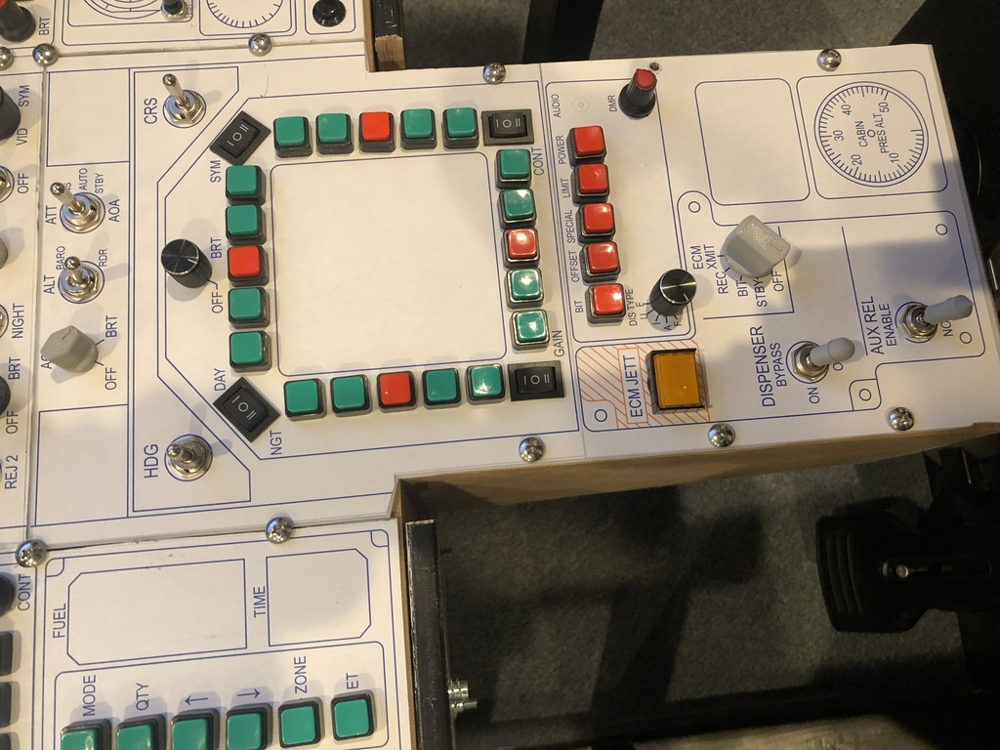

# Arduino code

When I started, I used the excellent [Leo Bodnar](http://www.leobodnar.com/shop/index.php?main_page=index&cPath=94&zenid=8e73e676aaff458fbce1cb81d2dc268f)
boards for my controls, but going forward I plan to use Arduino.  They provide a bit more flexibility, and
I find the coding fun.  My favorite "get started" resource is
[this video](https://www.youtube.com/watch?v=Z7Sc4MJ8RPM) which explains how to build a box using matrix wiring and
provides a link to [the code that drives it](https://github.com/AM-STUDIO/32-FUNCTION-BUTTON-BOX).  Just note that
if you use any latched switches like toggles in your design you'd want to add diodes to prevent ghosting.

## Which Arduino boards work?

The options may be broader if you plan to use DCSbios, but if you want to treat your Arduino as a USB_HID (like a joystick)
you will need one that uses the ATmega32U4 chip.  This includes the [Micro](https://store.arduino.cc/usa/arduino-micro)
and the [Leonardo](https://store.arduino.cc/usa/leonardo), but I have used
[these knockoff "Pro Micro" boards](https://www.amazon.com/gp/product/B07FXCTVQP/ref=ppx_yo_dt_b_search_asin_title?ie=UTF8&psc=1)
that can be had for <$20 for a pack of three on Amazon.

## Necessary libraries

There are two that I've used:
* [MHeironimus's joystick library](https://github.com/MHeironimus/ArduinoJoystickLibrary) is what allows Windows to see your
Arduino as a joystick.  You can set it up with up to 11 axes and 128 buttons.
* [brianlow's rotary encoder library](https://github.com/brianlow/Rotary) makes using encoders easy.

## My code

There are two programs here:
* [**04_Hornet_Supplemental_Controls.ino**](04_Hornet_Supplemental_Controls.ino)
is what I use for the supplemental buttons I added to my cockpit to make things easier
to use in DCS in VR (bottom right of the front instrument panel, see picture).  Not part of the real aircraft, but I use it for things like
VR recenter, labels on/off, NVG goggles on/gain, and kneeboard management.  This also winds up picking up the slack from a few other places
where I didn't have ehough inputs.  This program includes code that reads a button matrix as well as rotary encoders.

* [**05_Hornet_AMPCD_CMS.ino**](05_Hornet_AMPCD_CMS.ino) was created when I added the
APMCD to my build.  It is used for the bottom half of the HUD controls,
the APMCD, and the countermeasures panel.  Again, this includes a switch matrix and also has a couple of analog inputs.  With this program,
I figured out how to send joystick inputs both when a toggle is turned ON as well as when it is turned OFF.  I'm
in the process of editing this to remove some jitter on the analog inputs.

## Next steps

I plan to pull out a couple of the Bodnar boards I have and replace with Arduinos.  The Bodnar boards are fantastic, but
there are some specific things I want to do that need a bit more flexibility and will increase the number of inputs required.

