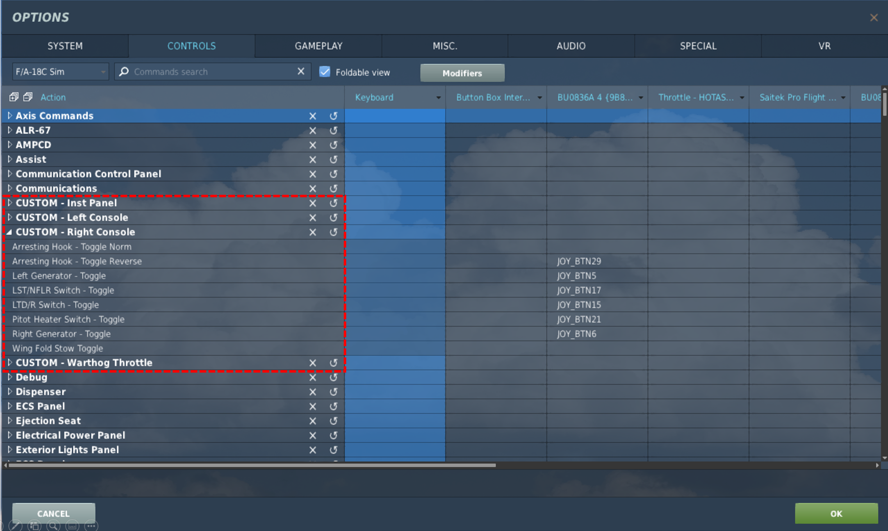

# DCS .lua code

Two categories here:
* The "default\*.lua" files add custom entries in the control setup pages within DCS.  Can use these to make 
ON-OFF toggles work properly.
* "CMDS_ALE47.lua" replaces the default countermeasures programs with something I find more helpful.  Replace
the file found at *~\DCSWorld\Mods\aircraft\FA-18C\Cockpit\Scripts\TEWS\device* with this version.

# Using toggle switches in DCS

Toggle switches present a challenge when building any kind of button box.  While they send an input when you
turn the toggle "on," they don't provide any kind of signal when you turn the toggle "off."  There are some
ways around this:
* You can use ON-ON toggles rather than ON-OFF, but that takes up twice as many inputs on your interface board.
* You can write Arduino code that will send an output not only when a toggle is switched ON, but also when it's switched OFF.
Examples of this type of coding can be found in
[this program](https://github.com/ColdFrontWI/Hornet_Cockpit/blob/master/Arduino%20Code/05_Hornet_AMPCD_CMS.ino) in the
[Arduino Code](https://github.com/ColdFrontWI/Hornet_Cockpit/tree/master/Arduino%20Code) folder.

Fortunately, DCS offers a way to handle this by adding custom controls to an aircraft's control setup menu.  These are
sored in the "default.lua" file.  And some of these types of controls may already be set up:
* In the A-10C, all of the toggles on the TM Warthog throttle work out of the box
* On the Hornet, ED has added appropriate functionality for all of the three-way ON-OFF-ON toggles in the cockpit and a
selection of the two-way ON-OFF toggles.  But many of the ON-OFF toggles will require you to add your own custom controls.

You should be able to add any of the "default - *Aircraft* append.lua" files in this folder, to the "default.lua"
file for the relevant plane, and additional options will show up in the DCS control setup.  Just be sure to take
note of *where* you add the append file.  This is noted in comments of the Hornet version of the file, but I put it
right after the
~~~
join(res.keyCommands,{
~~~
line in default.lua.  Once you edit
default.lua you will see some additional control groups in the setup page (see picture below).
You can then bind them to whichever switch you want.  For reference, the Hornet's default.lua file is located at
*~\DCSWorld\Mods\aircraft\FA-18C\Input\FA-18C\joystick* within the DCS installation.
  

## Other notes
* For my cockpit, I set some of the controls up in "reverse" for various reasons.  For example, the toggle I
use for the arresting hook is "on" in the down position rather than up.  If you find some of my custom controls
work in reverse, you can edit it to suit your needs.
* Some switches in the real cockpits are electronically held, so they can automatically be switched off.  Anti-skid
in the Warthog, and LTD/R ARM in the Hornet are examples.  These often have a different value for the "OFF" position
than other switches, so if one is not working you may need to edit.
* Recommend you keep a copy of your "append" file around separate from the main default.lua.  DCS updates occasionally
overwirte default.lua, and if you don't have the append file you'll have to rewrite from scratch.  Ask me how I know ;).

## Other aircraft

Obviously not relevant for the Hornet, but I'm also including the files I set up for the Warthog and the Mustang here.
