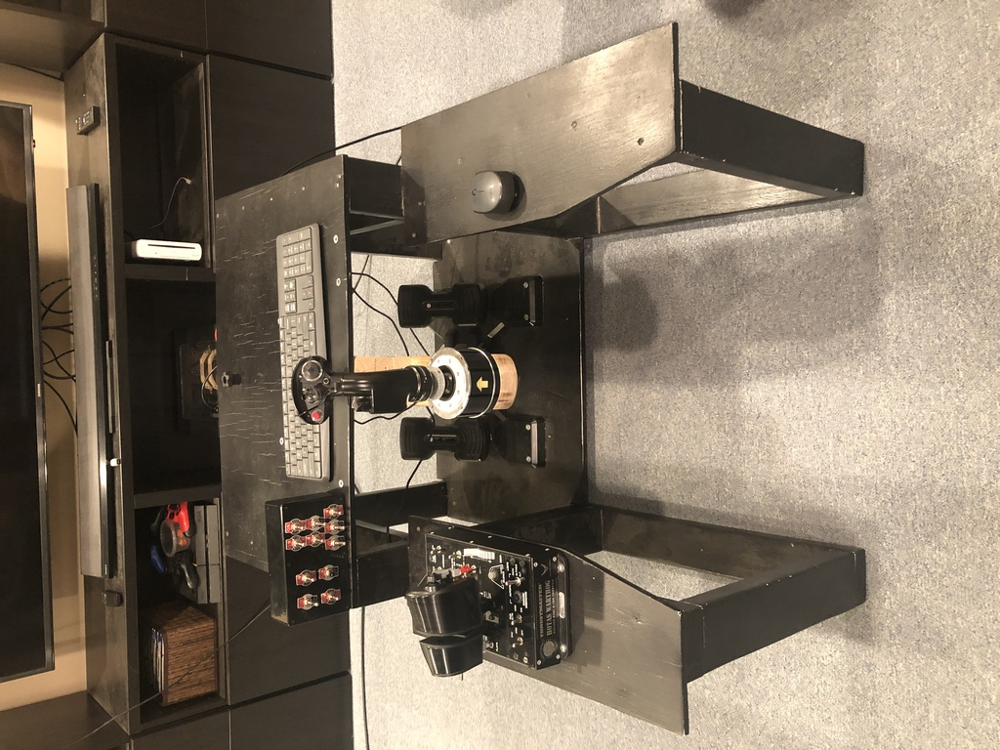

# A bit of history

The core of this home pit dates back well before the Hornet.  It started out as a flexible/modular system on which I
could easily swap controls between a yoke/civilian throttle quadrant and my t Flight HOTAS at the time.  It also had
to easily slide out of the way and fit in a corner of the basement, which this does nicely.

When I got back into flight sims after a multiple-decade hiatus I expected to play mostly XPlane/MSFX (thus the yoke), but then I found
WarThunder, and racked up several hundred hours and got pretty good.  And then I found DCS and the time sink/spending
really increased.  I got a TM Warthog and built a simple switch box for the A-10C module that had some of the key controls
including all the arming switches, gear, etc.  That's about where this was back in Feb before I got started on the
Hornet pit.

## Configured for military flight sim
The stick is on an extension arm built from 2x4s that attaches to the underside of the table.  The button box on the left
is something I built for flying the Warthog in VR in DCS.  It has some of the most-used switches including the landing
gear as well as most of the arming panel.

## Configured for civilian flight sim
I added a plywood base to the yoke and the throttle quadrant with holes drilled so I could use hand screws to quickly
attach it to or remove it from the base.

## Stored
I stuck furniture sliders on the "front" of the pit so when I stand it up on it's end it will slide easily.  It's easy
to move it out of the way and slide it into the corner.

## The seat
Since I've been asked a couple of times, the seat here is basically a [kart racing seat that I found on
Amazon](https://www.amazon.com/gp/product/B007VRCTD6/ref=ppx_yo_dt_b_search_asin_title?ie=UTF8&psc=1) and mounted on
a DIY base.  Don't know if Amazon still carries it, but you can probably go directly to the manufacturer, JEGS.

