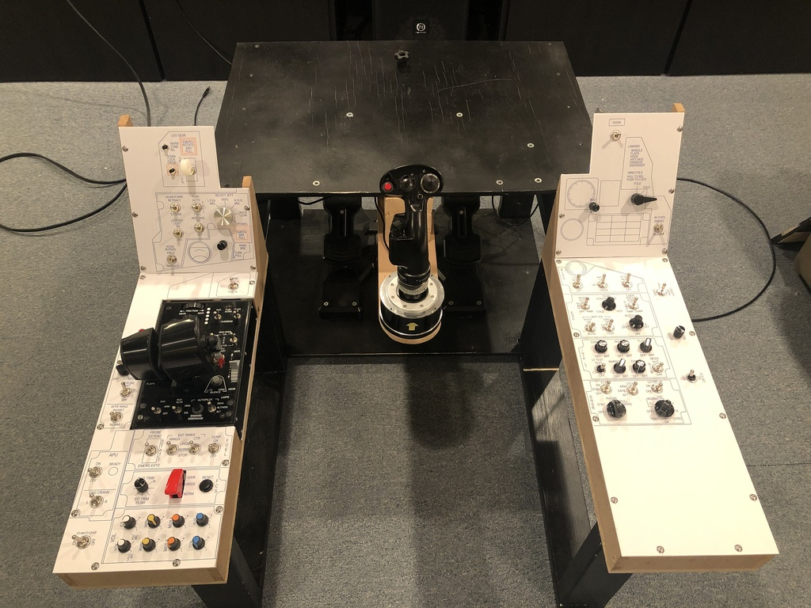
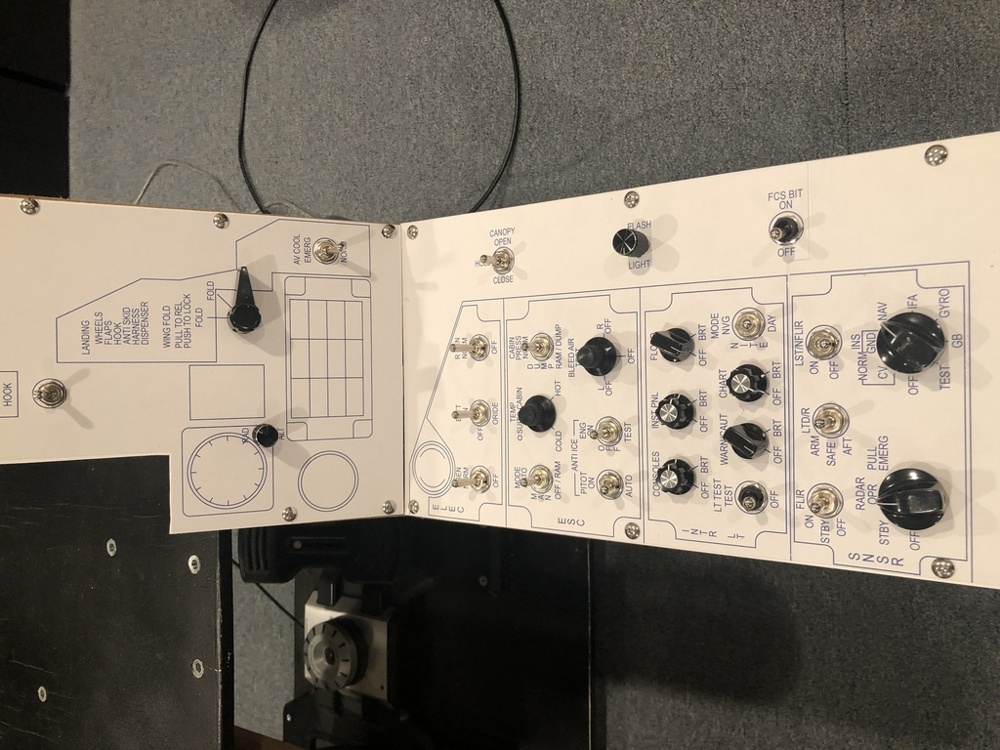
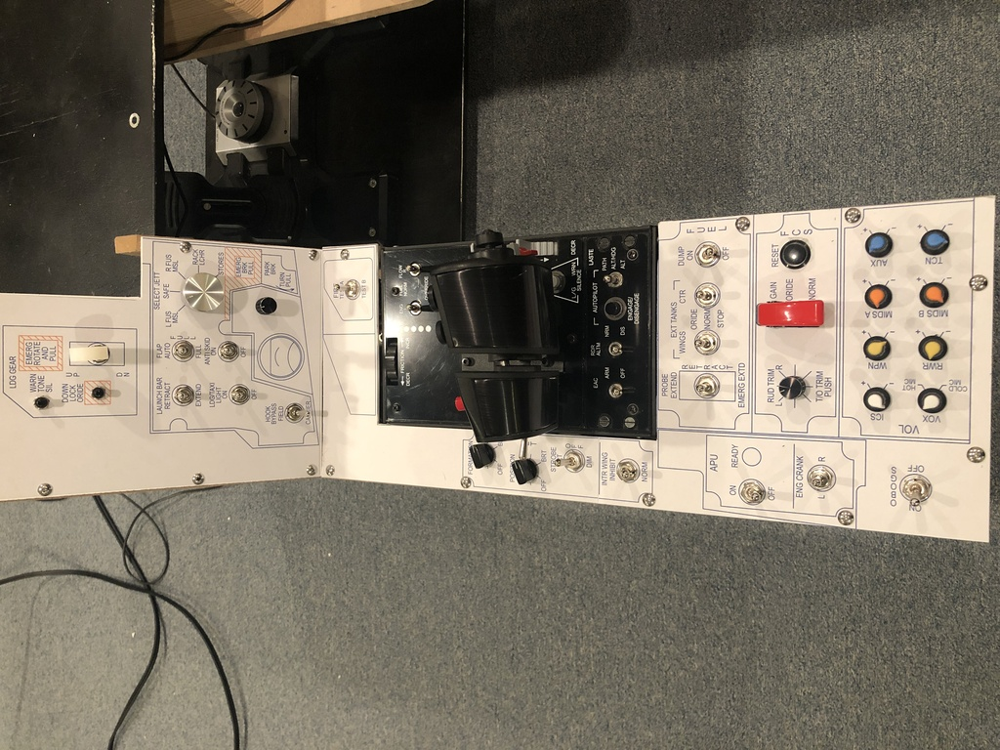
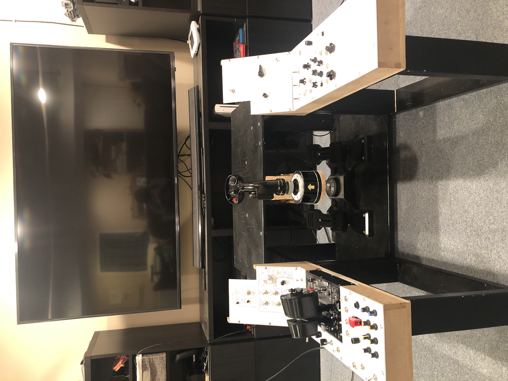
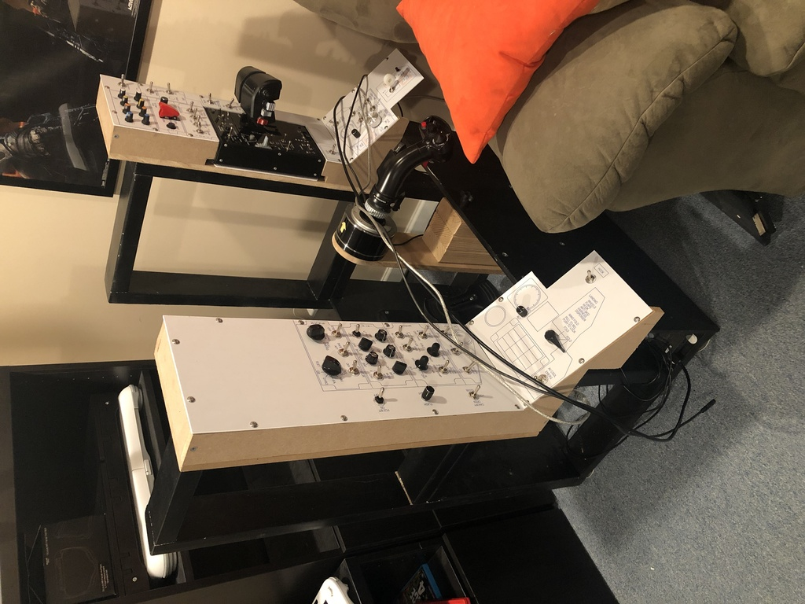

# The side consoles

By April, 2020 I had the two side consoles built.  The left side was designed to fit a Warthog throttle.  Also, I don't know if this
is reality, but based on the time I spent sitting in the Hornet DCS cockpit in VR I designed it so the left vertical panel (gear,
etc.) is closer to the pilot than the right side vertical panel (wing fold, arresting hook, etc.), so I built it that way.

And as of now it still fits neatly in the corner.

