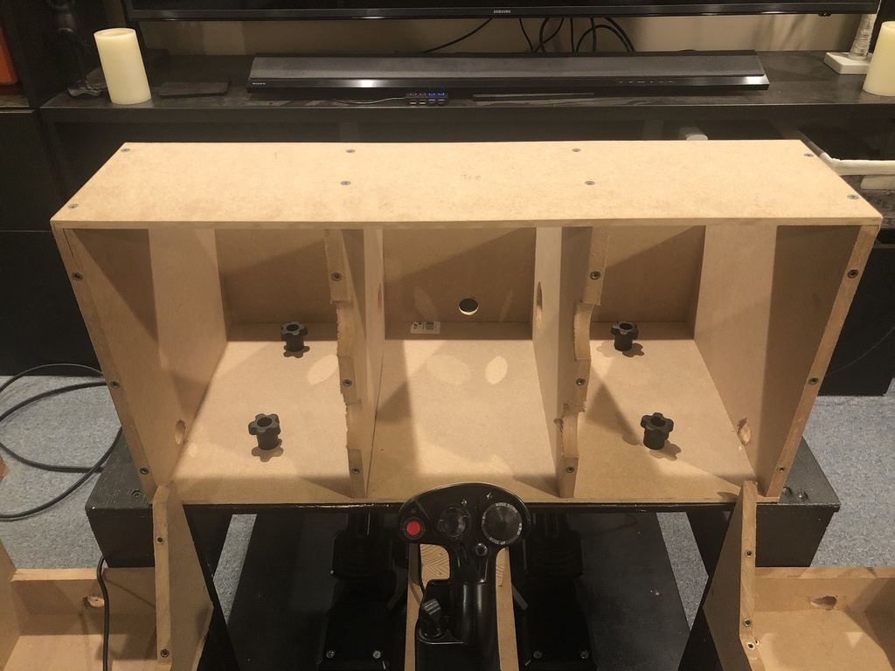
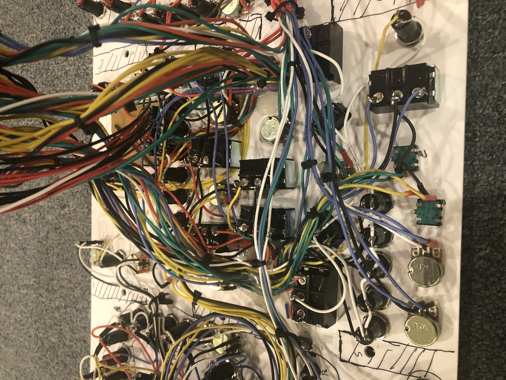
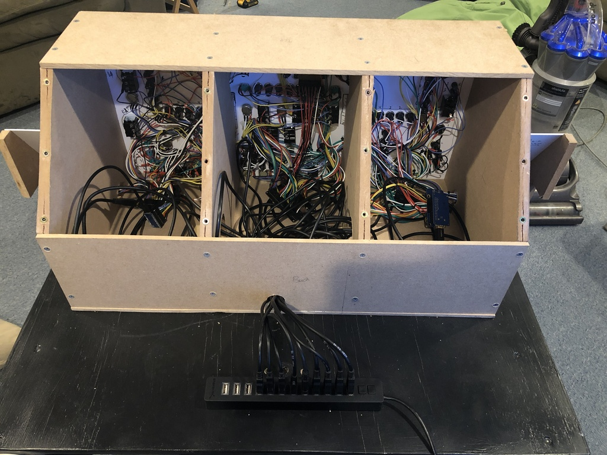

# The cockpit is...done?

## Enclosures

The enclosurs were built from MDF and screwed together.  The sides are 1/2" thick and the top/bottom (and back
of the front panel) are 1/4".  CAD files for the design for the framing pieces are located in the [DXF
Files/Enclosure folder](../../DXF%20Files/Enclosure).

## Panels / Wiring

The panels themselves are [1/8" white acrylic that I picked up from
Amazon](https://www.amazon.com/gp/product/B06XNXHZZH/ref=ppx_yo_dt_b_search_asin_title?ie=UTF8&psc=1).
For the markings, I inkjet printed onto [full sheet
labels](https://www.amazon.com/gp/product/B074KQRJKN/ref=ppx_yo_dt_b_search_asin_title?ie=UTF8&psc=1).
Because the panels are smaller than the labels, I had to trim and fit them together.  The CAD files that
make up the panel design are located in the [DXF Files folder](../../DXF%20Files/Panel).  One of the key
features of the panel design are hole center marks to help with drilling and cutting the holes
necessay for all the buttons/switches/knobs.

For control boards, I used several of the [Leo Bodnar](http://www.leobodnar.com/shop/index.php?main_page=index&cPath=94&zenid=41f0a7f40298148d5ff5bead11e34d14)
boards including four [BU0836A boards](http://www.leobodnar.com/shop/index.php?main_page=product_info&cPath=94&products_id=204&zenid=fcc1bcaa9d9931558e9c9466170ca3ff)
combined with [Matrix Breakout boards](http://www.leobodnar.com/shop/index.php?main_page=product_info&cPath=94&products_id=274&zenid=fcc1bcaa9d9931558e9c9466170ca3ff)
as well as one [BBI-64](http://www.leobodnar.com/shop/index.php?main_page=product_info&cPath=94&products_id=274&zenid=fcc1bcaa9d9931558e9c9466170ca3ff).

This design also includes one [Arduino knockoff "Pro Micro"
board](https://www.amazon.com/gp/product/B07FXCTVQP/ref=ppx_yo_dt_b_search_asin_title?ie=UTF8&psc=1) for the "supplemental"
switches at the bottom right of the front panel.  This particular
board can be set up to behave like a USB HID, so DCS sees it as a game controller.  The Bodnar boards are great, but with
Arduino I can do things like setting an on-off toggle to send a joystick button press when the switch is either turned
on *or* off which helps avoid some .lua code in the setup.

### Side consoles

Each uses a Bodnar BU0836A plus a Matrix breakout board, and the eft side is designed to fit around the the Warthog Throttle. 

#### Left side

#### Right side

###  Instrument panel

Built on a single piece of acrylic using four control boards including two Bodnar BU0836As and a Bodnar BBI-64.  The bottom
right supplemental buttons use an Arduino-compatible Pro Micro board.

#### Left

#### Center

#### Right

On the Bodnar board on this side, I skipped the breakout board for the BU0836A and wired the matrix myself directly
including the diodes needed to avoid ghosting.  I learned that it's actually much easier to wire this way, and results in
a lot less spaghetti.

#### Instrument panel assembled

I'm pretty happy with the way it came together.  I added a [13-port powered USB
Hub](https://www.amazon.com/gp/product/B00HL7Z46K/ref=ppx_yo_dt_b_search_asin_title?ie=UTF8&psc=1)
so I only need to connect one wire to my PC.  Well, actually two...in order for all devices to be recognized I also
need to provide external power to the hub.

## Looking good

Overall, I'm very happy with how this turned out.  It's easy to connect/disconnect, easy to move out of the way in the room, and
it's pretty easy to find the controls, even in VR.  It even still fits in the corner, although I did have to move the couch a couple of inches.

## So I'm done now, right?

Not so fast!  As you I can see, I left off the AMPCD--this was due to way the stick was mounted.  The problem was that I kept reaching for
the AMPCD in VR.  So the next major phase was modifying to add the AMPCD...

