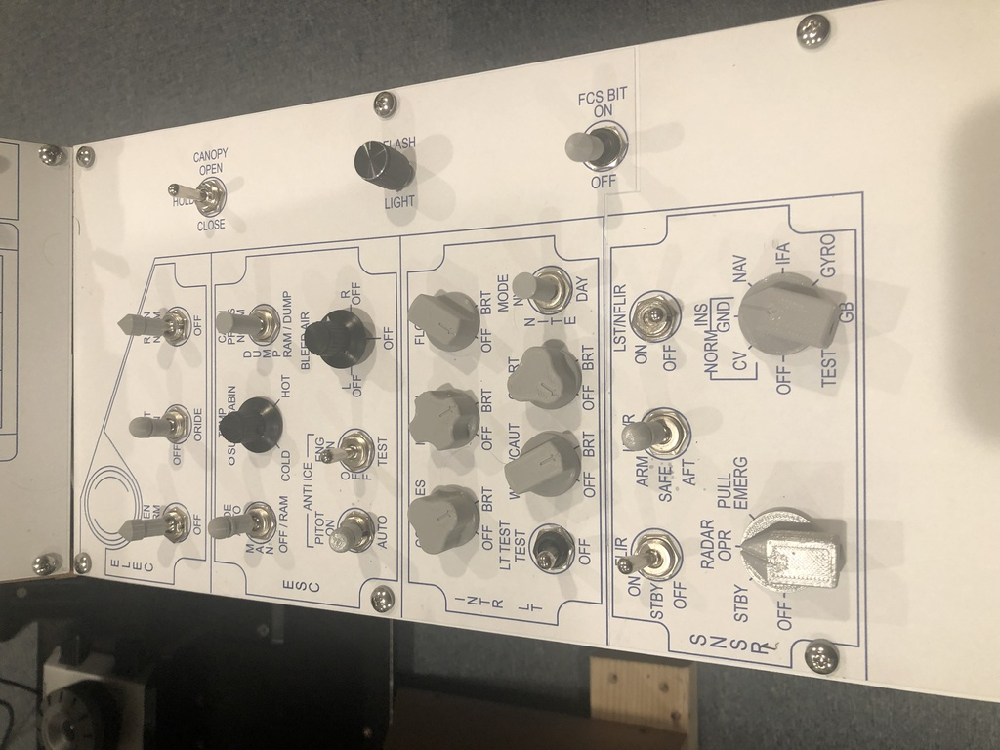

# An AMPCD and some fancy knobs

I was really enjoying the design as it existed, but I did find a couple of problems that made it a challenging in VR:
* Some switches and knobs were hard to identify.  I had bought a few knobs that kind of mirrored the shapes in the actual cockpit,
but some were impossible to find.  I also had no way to differentiate toggles, which meant a lot of counting by feel to figure
out which switch I needed to use.
* I got so used to using my panels that I would often reach for the OSBs on the AMPCD, but...I didn't have an AMPCD!  So I would then have
to feel around for my mouse to work with the AMPCD.

## Knobs and switches

To help with identification of controls in VR, I picked up a [Creality Ender 3 Pro 3D printer](https://www.amazon.com/gp/product/B07K3SZBHJ)
and designed a bunch of custom [knobs](../../STL%20Files/Knobs) and [switch caps](../../STL%20Files/Switches).  There is a bit
more detailed information on the designs in the readme files in those locations.

### Knobs

A few custom shapes for various potentiometer and rotary switches in the cockpit, including the parking brake
handle.  For the most part I have made these to fit over splined 6mm shafts.  All of the designs are over in
the [STL Files section](../../STL%20Files/Knobs).  I have made a few more since the pictures below.

### Basic switch caps

The Hornet seems to have three "non-standard" switches that are used in several places in the cockpit including
one with a pointy top, one with a dome, and one with a flat top.  In addition, there are unique switches for the
flaps, the launch bar, and the landing/taxi lights.  All of the designs below are in the [STL Files
section](../../STL%20Files/Switches).

### Lever handles

My design uses toggles for the landing gear and arresting hook controls, so I printed handles for those as well.

## The AMPCD

To make this modification, I had to cut away some of the existing insturument panel to fit the replacement.
I also had to change the way my stick was mounted.  Timing here was convenient, as I had recently received my Virpil
WarBRD base to replace my trusty if somewhat sticky TM Warthog.  I also had to add an additional [Arduino-compatible
Pro Micro control board](https://www.amazon.com/gp/product/B07FXCTVQP) to drive the additional switches and buttons.

## Putting it together

With the AMPCD, the Virpil bsae, and all the custom switches and knobs, this setup is a blast to fly with and really
easy to use in VR.  And it even still fits in the corner!

## Next steps

There are of course already a few things I'm contemplating.
* I want to replace some of the rotary encoders with proper rotary switches, specifically the INS, Radar, and Jettison
select knob.  For the Jettison select knob/button, I plan to use [blue73's excellent design from the ED
forums](https://forums.eagle.ru/showthread.php?t=239718), see picture below.  I'm also going to try swapping out the
parking brake rotary encoder for a push/pull potentiometer as [TekCreations describes on their Hornet panel design
page](https://www.tekcreations.space/f18-landing-panel-part-2/?v=7516fd43adaa).
* To make the changes above, I will probably rewire the left and right consoles with Arduino-based boards.
* I want to add the countermeasures "slap button."  My pit doesn't have a side wall, so I'll probably just put it
somewhere on left console panel.
* I want look at swapping many of the pushuttons (e.g. all of the OSBs on the three displays) for tactile switches, and
print custom keycaps.

