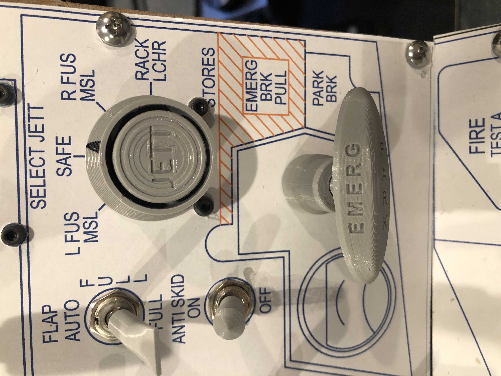
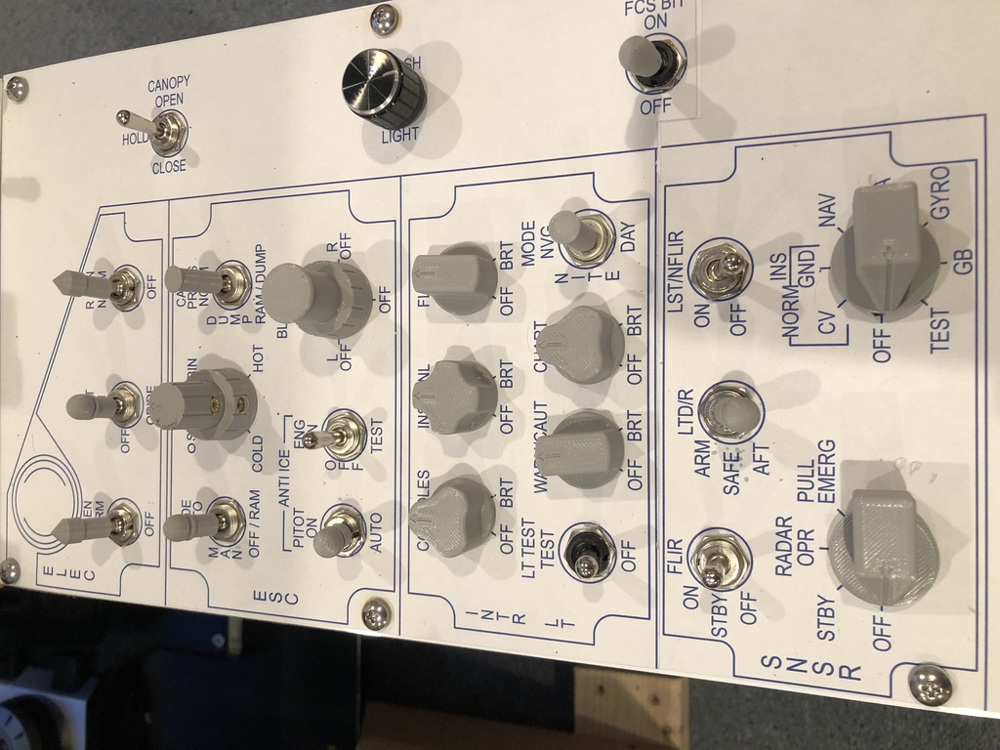
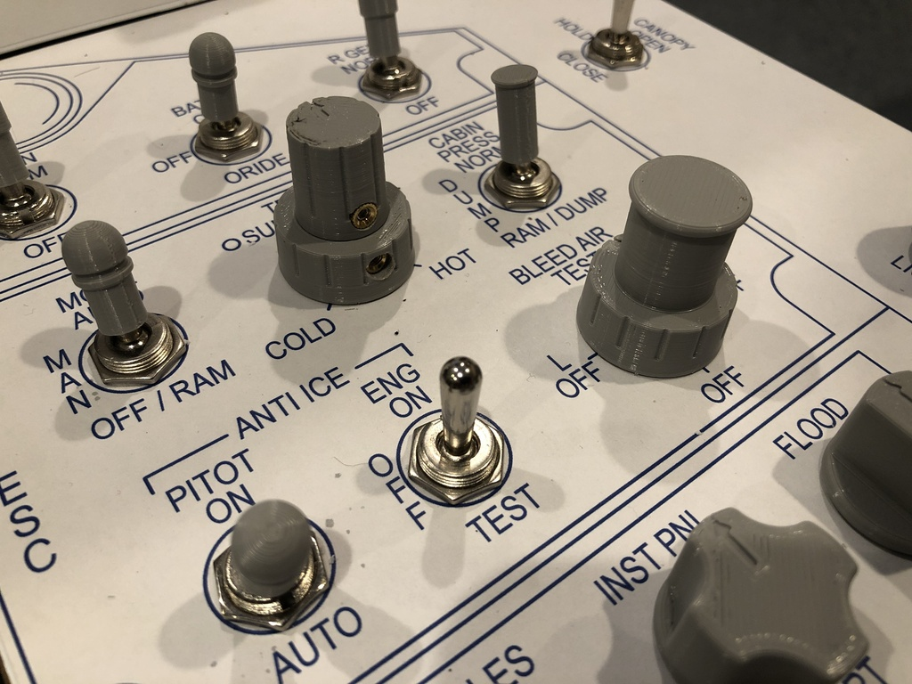
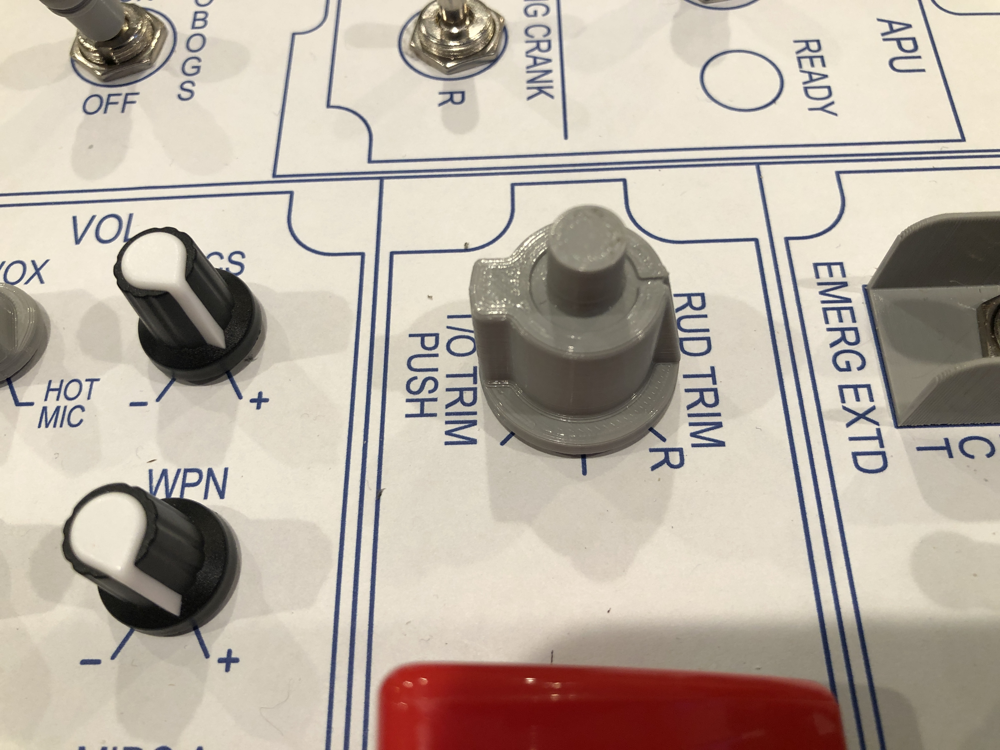

# A few key functional updates

Not many new pictures at this point, but some pretty nice updates.  First, I've added a couple of new
controls.
* I installed [blue73's Jettison Control](https://forums.eagle.ru/showthread.php?t=239718), replacing
the rotary encoder that was there before.  This thing is awesome!
* I changed the hand brake mechanism.  I previously had a pushbutton rotary encoder here, but replaced it with
a push-pull potentiometer, and designed a collar to ensure it moves in a way that's consistent
with the movements in the plane.  This was inspired by [TekCreations use of a push-pull
pot.](https://www.tekcreations.space/f18-landing-panel-part-2/?v=7516fd43adaa)  The STL files
for the collar, the shaft, and the top handle can be found in [the STL files
section.](../../STL%20Files/Other)
* I also swapped the encoders being used for the Radar and INS for proper rotary switches.  Previously it was
way too easy to accidentally bump the INS when using the targeting pod switches.

Those controls were enabled by the biggest change: Swapping out the Bodnar boards on the left
and right consoles for Arduinos.  I wound up using two knock-off Pro Micros in each side (one for switches
and one for analog inpugs and encoders), but this provides a number of nice features:
* **More inputs:** The Bodnar boards I had were limited to 36 digital inputs, and I ran out of inputs
and had to run wires for a couple of things main panel.  This is no longer
necessary.  In the end I have ~50 unique buttons on each side.
* **Send button on both on and off:** I wrote the code so that it sends a joystick button both when a
switch is turned on as well as when it is turned off.  So even though many of my switches are on/off
(e.g. landing gear), it can send a joystick button push in both directions.

I also 3D printed some more knobs including the Bleed Air and Cabin/Suit temp as a rudder trim knob.
For the temp knob, I used a stacked concentric potentiometer...because you know, it's important to
be able to turn those knobs in the cockpit! ;)

