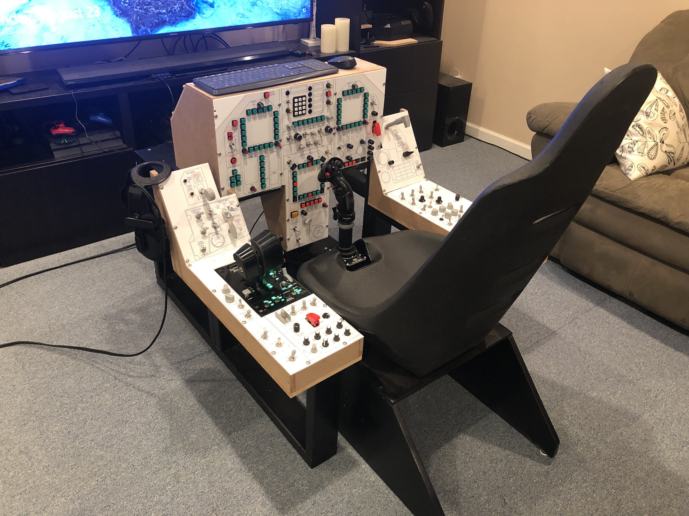

# Pictures

As I have reached major milestones in the build, I have taken some pictures, and have done a brief
writeup of where the project was at that point.

* [**February 2020:**](2020-02/Readme.md) This shows the frame I had built several years ago that all of the
Hornet cockpit mods are attached to.
* [**April 2020:**](2020-04/Readme.md) I had the side consoles built at this point.
* [**May 2020:**](2020-05/Readme.md) Had the side consoles and the original version of the instrument panel built.
This page includes a lot of "behind the scenes" pictures and detail about how each panel was assembled.
* [**August 2020:**](2020-08/Readme.md) Pictures after modifying it to include the AMPCD, as well as adding
bunch of custom-designed, 3D-printed knobs and switches.

