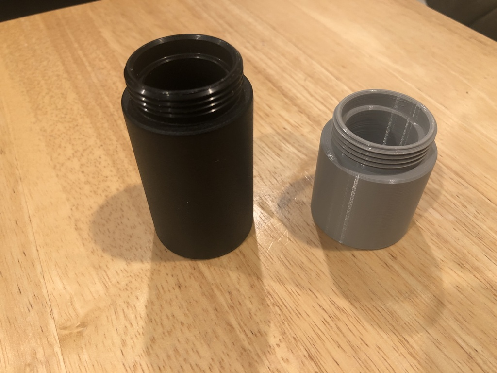
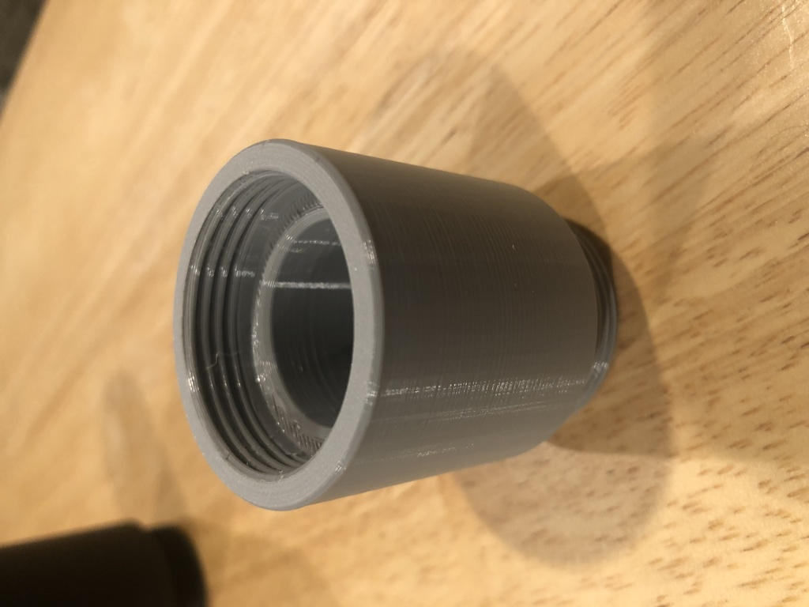
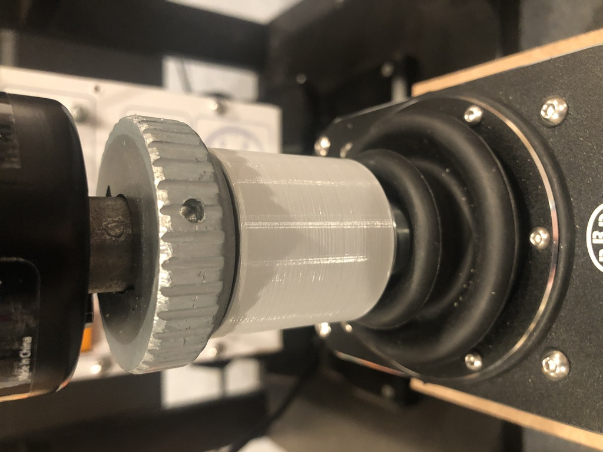

# Warthog / Virpil stick extensions

I had a 75mm extension that I was using with my Virpil WarBRD base and Thrustmaster Hornet grip, but I found that
my setup really needed a 50mm.  I wasn't too keen on spending >$50 (with shipping) and waiting until one was in
stock from Virpil or another supplier, so I decided to design and 3D print my own.  The 50mm design was well-received
when I shared it, and one person requested a different length so I made several between 25 and 100mm.

Note there are three versions of each.  I found that the 36mm female thread on these designs was VERY tight
and difficult to install on my setup, so I created versions where the female threads are 36.5 and 37.0mm.
I think my issue with the 36.0mm may be my printer being slightly out of square, but the 36.5 and 37.0
fit nicely.  You may need to experiment to find out which gives the best fit with your setup.

### 50mm design side-by-side with a 75mm from Virpil

### The female threads

### Installed between WarBRD base and TM Hornet grip

